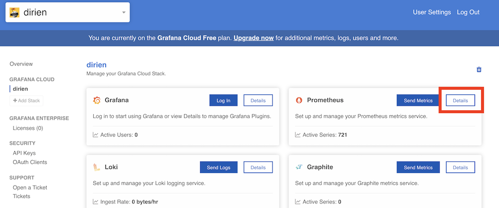
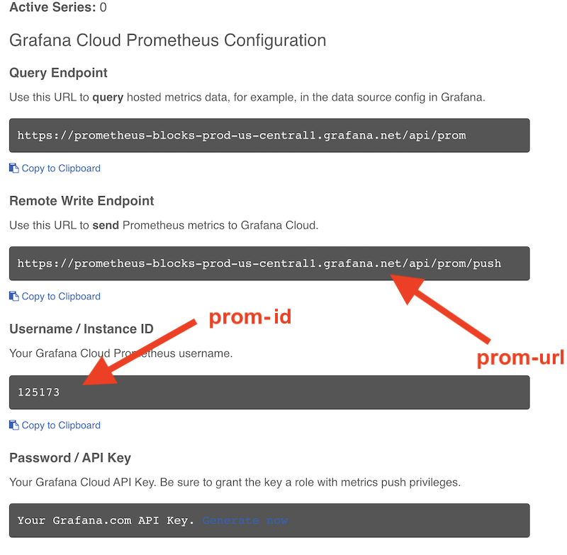
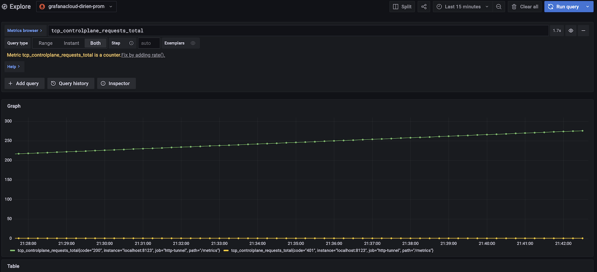

# How to run an inlets exit server on Oracle Cloud Infrastructure - Update: With Grafana

This is the update of the existing how-to article, about running an exit server on Oracles Cloud Infrastructure.

This time, we are ready for the upcoming major update of Inlets v0.9.0. We have finally the opportunity to measure and
monitor your inlets tunnels. [Alex Ellis](https://twitter.com/alexellisuk) covered all the upcoming new functionalities
in his own blog [post](https://inlets.dev/blog/2021/08/18/measure-and-monitor.html). So go and check this out.

Here, I want to focus only on the Prometheus part of inlets pro v0.9.0.

So what did change in the code? Nothing on the infrastructure side. We still run on OCI, the only difference is that we
now deploy in the cloud-init the Grafana agent to use the [Grafana Cloud](https://grafana.com/products/cloud/).

## Grafana Cloud

_What is the Grafana Cloud?_

> Grafana Cloud is a composable observability platform, integrating metrics, traces and logs with Grafana. Leverage the best open source observability software – including Prometheus, Loki, and Tempo – without the overhead of installing, maintaining, and scaling your observability stack.

And they offer a free tier, which is absolutely perfect for us to use with our inlets exit nodes. The free tier
includes:

- 10,000 series for Prometheus or Graphite metrics
- 50 GB of logs
- 50 GB of traces
- 14 days retention for metrics, logs and traces
- Access for up to 3 team members

So create an account.

### Grafana Agent

The Grafana Agent collects observability data and sends it to Grafana Cloud. Once the agent is deployed to your hosts,
it collects and sends Prometheus-style metrics and log data using a pared-down Prometheus collector.

The Grafana Agent is designed for easy installation and updates. It uses a subset of Prometheus code features to
interact with hosted metrics, specifically:

- Service discovery
- Scraping
- Write ahead log (WAL)
- Remote writing

Along with this, the agent typically uses less memory than scraping metrics using Prometheus.

### API Key

After you created an account, we need to get the values for the three new variables the updated `terraform` script
needs:

````terraform
prom-id = xxx
prom-pw = xxx
prom-url = xxx
````

Just follow this instruction  https://grafana.com/docs/grafana-cloud/reference/create-api-key/ to get the `API key` we
going to use as `prom-pw`

The `prom-id` and `prom-url`, we find both in the same spot in your account details page int the prometheus details:



Click on `Details`:



Grab the Remote Write Endpoint and Instance ID.

### Agent Config.

Here is the full agent config, where are going to use. I will go more into the details, for the special points.

```yaml
server:
  log_level: info
  http_listen_port: 12345
prometheus:
  wal_directory: /tmp/wal
  global:
    scrape_interval: 60s
  configs:
    - name: agent
      scrape_configs:
        - job_name: 'http-tunnel'
          static_configs:
            - targets: [ 'localhost:8123' ]
          scheme: https
          authorization:
            type: Bearer
            credentials: ${authToken}
          tls_config:
            insecure_skip_verify: true
      remote_write:
        - url: ${promUrl}
          basic_auth:
            username: ${promId}
            password: ${promPW}

integrations:
  agent:
    enabled: true

  prometheus_remote_write:
    - url: ${promUrl}
      basic_auth:
        username: ${promId}
        password: ${promPW}
```

Inlets scraping config

```yaml
...
scrape_configs:
  - job_name: 'http-tunnel'
    static_configs:
      - targets: [ 'localhost:8123' ]
    scheme: https
    authorization:
      type: Bearer
      credentials: ${authToken}
    tls_config:
      insecure_skip_verify: true
...
```

This section is directly from the how-to of [Alex](https://inlets.dev/blog/2021/08/18/measure-and-monitor.html) I just
substituted the credentials with a template variable.

```yaml
...
remote_write:
  - url: ${promUrl}
    basic_auth:
      username: ${promId}
      password: ${promPW}
...
prometheus_remote_write:
  - url: ${promUrl}
    basic_auth:
      username: ${promId}
      password: ${promPW}
```

We're going to use here the remote write functionality. The Grafana Agent, will push any collected metrics, to our
central Prometheus in the Grafana cloud. This will all done via `pushing` the scraped metrics. Keep this in mind, as
this is a major difference to a classic prometheus installation you may have worked with.

I highly recommend you watch following YouTube
video [The Future is Bright, the Future is Prometheus Remote Write - Tom Wilkie, Grafana Labs](https://www.youtube.com/watch?v=vMeCyX3Y3HY)

That's it, with the new bits. Now we can deploy the whole stack via:

```bash
terraform apply --auto-approve 
...
terraform output inlets-connection-string 
```

When you log into Grafana, you can now start to display your inlets metrics:



Use the how-to of [Alex](https://inlets.dev/blog/2021/08/18/measure-and-monitor.html) for all the available metrics.

## Inlets

For anyone not familiar with inlets. It's a project from [Alex Ellis](https://twitter.com/alexellisuk), a CNCF
Ambassador and the Founder of OpenFaaS.

> Cloud Native Tunnel You can use inlets to connect HTTP and TCP services between networks securely. Through an encrypted websocket, inlets can penetrate firewalls, NAT, captive portals, and other restrictive networks lowering the barrier to entry.
>
>VPNs traditionally require up-front configuration like subnet assignment and ports to be opened in firewalls. A tunnel with inlets can provide an easy-to-use, low-maintenance alternative to VPNs and other site-to-site networking solutions.

## Oracles Cloud Infrastructure

Oracles Cloud Infrastructure (OCI) is the nearly perfect place to start an inlets exit node. After you created an
account, you will not only get a whopping $300 (250€) in cloud credit, but also some selected resources for free.
Forever!

Oracle is calling
them [Always Free Resources](https://docs.oracle.com/en-us/iaas/Content/FreeTier/freetier_topic-Always_Free_Resources.htm#resources)

So what do we from a compute point of view:

> Micro instances (AMD processor): All tenancies get two Always Free VM instances using the VM.Standard.E2.1.Micro shape, which has an AMD processor.

That is amazing as it is exactly what we need for an inlets exit node.

Unfortunately, [inlets](https://github.com/inlets/inletsctl) is not supporting OCI at the moment. So to still enjoy the
perks of OCI and inlets we're going to use Terraform to install the exit node. Classic...

## How-to

### Binaries

We're going completely vanilla to this. So only `terraform` and inlets `inletsctl` is needed.

```bash
# Install to local directory (and for Windows users)
curl -sLSf https://inletsctl.inlets.dev | sh

# Install directly to /usr/local/bin/
curl -sLSf https://inletsctl.inlets.dev | sudo sh

brew install terraform
```

We need the inlets-pro binaries to connect to the exit server

```bash
inletsctl download
2021/08/16 01:11:11 https://github.com/inlets/inlets-pro/releases/tag/0.8.9
Starting download of inlets-pro 0.8.9, this could take a few moments.
Download completed, make sure that /usr/local/bin is on your path.
inlets-pro version
```

### OCI API Keys

After you created your OCI account, you can crate your API keys. These are special type of public keys used to perform
any kind of API operations. There are different ways to create this API keys.

To keep in simple, I prefer the UI way:

1. Open the Console, and sign in.
1. View the details for the user who will be calling the API with the key pair:
    - If you're signed in as the user:
    - Open the Profile menu (User menu icon) and click User Settings.
1. Click Add Public Key.

After this, you will be greeted with a dialog with all the relevant information you need for `terraform` to run.

Then rename the `terraform.tfvars.changme` in `terraform.tfvars` and fill out the infos from above

```terraform 
tenancy_ocid = xx
user_ocid = xx
private_key_path = xx
fingerprint = xx
region = xx
ssh_public_key = xx
```

### Terraform

Now, that you filled out the information, the `terraform` OCI provider needs, you can simply run your `terraform`
commands

```bash
terraform init

terraform plan

terrafrom apply
```

If everything works like `plan`ed, you should see following, similar output:

```bash
oci_core_instance.inlets-ubuntu-instance: Creation complete after 48s [id=ocid1.instance.oc1.eu-frankfurt-1.antheljtoboqxvycp3pui4xy5rva6nmna2siow2tgukeggpmatvl5nzeskpa]

Apply complete! Resources: 7 added, 0 changed, 0 destroyed.

Outputs:

inlets-connection-string = <sensitive>
```

Type ` terraform output inlets-connection-string` to see the connection details

```bash
inlets-pro tcp client --url wss://158.101.189.144:8123 --token RFMLihTUZ2WQbHkRNPRsATAJDqjgvMx7XywjiwFqB7nUI3HOLOwF8LMw8Nsk79TG --upstream $UPSTREAM --ports $PORTS
```

Now you can expose every local application via the variables `$UPSTREAM` adn `$PORT`

```bash
inlets-pro tcp client --url wss://158.101.189.144:8123 --token RFMLihTUZ2WQbHkRNPRsATAJDqjgvMx7XywjiwFqB7nUI3HOLOwF8LMw8Nsk79TG --upstream $UPSTREAM --ports $PORTS
2021/08/16 00:43:01 Starting TCP client. Version 0.8.9 - 7df6fc42cfc14dd56d93c32930262202967d234b
2021/08/16 00:43:01 Licensed to: Engin Diri <Engin.Diri@mail.schwarz>, expires: 6 day(s)
2021/08/16 00:43:01 Upstream server: localhost, for ports: 8080
inlets-pro client. Copyright OpenFaaS Ltd 2021
INFO[2021/08/16 00:43:01] Connecting to proxy                           url="wss://158.101.189.144:8123/connect"
INFO[2021/08/16 00:43:01] Connection established.. OK.
```

### Clean up

If you don't need the inlets tunnel anymore, just type:

`terraform destroy` to purge everything.

## Fancy for more?

Join the inlets [slack](openfaas.slack.com) channel. 
